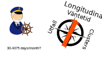

```{r setup, include=FALSE}
knitr::opts_chunk$set(echo = FALSE)
```


[//]: # (css classes to hide for getting rid of play button and bar)
[//]: # (slider-container, updatemenu-item-rect )


```{js}

  function sentry(s){
      console.log("startanim");
      Plotly.animate($(s)[0],null, { frame: { duration:2000}, transition : {duration:2000}});
  }


$( document ).ready(function() {
  
  window.slidedeck.slides[1].setAttribute("slideenter", "sentry('#plot1 > .js-plotly-plot');");
  window.slidedeck.slides[2].setAttribute("slideenter", "sentry('#plot2 > .js-plotly-plot');");
  window.slidedeck.slides[11].setAttribute("slideenter", "sentry('#plot3 > .js-plotly-plot');");

});


```


## Start

<div id="plot1">
```{r message=FALSE, warning=FALSE}
library(plotly)
library(htmlwidgets)

f1 <- data.frame(
  x = c(1,2,4,5,1,NA,2.5,3,3.5), 
  y = c(2,1,1,2,2,NA,2,3,2)
)

f2 = f1
f2$x = f2$x + 10

df = rbind(f1,f2)

df$f = rep(1:2, each = NROW(f1))

x = seq(from = 0, to = 10, length.out = 200)
ds = data.frame(x, y = sin(x*3)/3+ 1-1/3)


m <- list(
  l = 0,
  r = 0,
  b = 0,
  t = 0,
  pad = 4
)


p <- df %>%
  plot_ly(
    showlegend = F
    ) %>% 
  add_lines(y = ~y,  x = ~x, data = ds, mode = 'lines', color = I('blue')) %>%
  add_trace(y = ~y, x = ~x, frame = ~f, name = 'trace 0',mode = 'lines', color = I('brown'), data = df) %>%
    layout(xaxis = list(showgrid = F, range = c(0,10),
        title = "",
        zeroline = FALSE,
        showline = FALSE,
        showticklabels = FALSE,
        showgrid = FALSE), 
      yaxis = list(showgrid = F,range = c(-2,4), 
        title = "",
        zeroline = FALSE,
        showline = FALSE,
        showticklabels = FALSE,
        showgrid = FALSE), 
      autosize = T) %>% 
  animation_button(label ="Start") %>%
  animation_opts(frame = 2000) %>%
  animation_slider(hide = T) %>% 
  config(displayModeBar = F, displaylogo = FALSE)  

ggplotly(p)  %>%  onRender("
    function(el) { 
      console.log('hallorender');
    
    }
  ")


```
</div>

## A wild obstacle appears

<div id="plot2">
```{r message=FALSE, warning=FALSE}
library(plotly)
library(htmlwidgets)

f1 <- data.frame(
  x = c(1,2,4,5,1,NA,2.5,3,3.5), 
  y = c(2,1,1,2,2,NA,2,3,2)
)

f2 = f1
f3 = f1
f1$x = f1$x - 10
f2$x = f2$x-3
f3$x = f2$x+4

df = rbind(f1,f2,f3)

df$f = rep(1:3, each = NROW(f1))

dh = data.frame(x = runif(40,6,8), 
                y = runif(40,1,6),
                t = round(runif(40)),
                f = rep(2,40))

dh1 = dh
dh2 = dh
dh3 = dh
dh3$f = 3
dh1$f = 1

dht = rbind(dh1,dh2,dh3)


m <- list(
  l = 0,
  r = 0,
  b = 0,
  t = 0,
  pad = 4
)

x = seq(from = 0, to = 10, length.out = 200)
ds = data.frame(x, y = sin(x*3)/3+ 1-1/3)

p <- df %>%
  plot_ly(
    showlegend = F
    ) %>% 
  #add_trace(x= ~x, y= ~y, frame = ~f,data = dht, name = "ptrace", mode="markers", type="scatter", color = I('black')) %>% 
  add_lines(y = ~y,  x = ~x, data = ds, mode = 'lines', color = I('blue')) %>%
  add_text(text= ~t, x= ~x, y= ~y, textposition = "top right", data=dh, color = I('black')) %>% 
  add_trace(x= ~x, y= ~y, frame= ~f, name = 'trace 0',mode = 'lines', data = df, color = I('brown')) %>%
    layout(xaxis = list(showgrid = F, range = c(0,10),
        title = "",
        zeroline = FALSE,
        showline = FALSE,
        showticklabels = FALSE,
        showgrid = FALSE), 
      yaxis = list(showgrid = F,range = c(0,6), 
        title = "",
        zeroline = FALSE,
        showline = FALSE,
        showticklabels = FALSE,
        showgrid = FALSE), 
      autosize = T) %>% 
  animation_button(label ="Stop") %>%
  animation_opts(frame = 1400) %>%
  animation_slider(hide = T) %>% 
  config(displayModeBar = F, displaylogo = FALSE)  

ggplotly(p)  %>%  onRender("
    function(el) { 
      console.log('hallorender');
    
    }
  ")


```

## Cleanup 
<div style="float:left">
> - Excel for initial exploration and some metadata
> - Data cleaning using R
</div>


## How to navigate?



## Land Ahoy!
> -  Something interesting related to waiting time?
> - Case severity?
> - Regions?
> - Sex!


---
<div style="font-size:17px; color:black;">No acute, only lateral + primary operation </div>

``` {r res1, echo=FALSE,  include=T, message=F, warning=F}
library(data.table)
library(ggplot2)
library(lubridate)
library(survival)
library(survminer)
library(rms)
library(plotly)
library(htmlwidgets)
library(gganimate)

source("plotlysurvival.R")


data = readRDS("cleaned.rds")

colors = c("#20948b","#de7a22")

# only elective cases
dv = data[akut == "Nej - Elektiv" & omop == "Nej"]

dv2 = dv[bracktyp == "Lateralt" & vantetid < 500 & vantetid > 0]

res.cox3 <- coxph(Surv(vantetid) ~ strata(SEX) + age , data =  dv2)


ggs = ggsurvplot(survfit(res.cox3), palette  = colors,ggtheme = theme_minimal(),data = dv2, conf.int = T,  ylab = "Proportion waiting", risk.table = T)

ggs$plot + transition_reveal(time)

# plotly_survival(ggs, strata_colours = colors,
#                           plot_title="Survival of Something",
#                           xaxis=list(title="days"),
#                           yaxis=list(title="surv", hoverformat=".2f"),
#                           plot_CIs = T,
#                           CI_opacity = 0.25,
#                           CI_linewidth = 0, 
#                           censor_size = 10,
#                           showlegend_all=T)

```

#

## What does this mean?
>- If two groups of each 100 men and women have a primary lateral inguinal hernia

>- After __100__ days, 53 women and 46 men waiting, __7__ more women

>- After __150__ days, 35 women and 26 men waiting, __9__ more women

>- After __200__ days, 20 women and 15 men waiting, __5__ more women


## A lot to explore...
>- Coxph model shows __~18%__ higher hazard rate for men (95% CI 13% - 28%, age adjusted)
>- Proportional hazards ok in base case
>- Explorative, not properly looked at biases/causal pathway
>- -> Be careful to draw conclusions!

## Conclusions to bring home?
>- Does it really matter?


## Thanks & Resources
>- Course coordinater, administrator and all lecturers
>- Henrik Holmberg
>- R, RStudio, and contributors

## Sail away

<div id="plot3">
```{r message=FALSE, warning=FALSE}
library(plotly)
library(htmlwidgets)

f1 <- data.frame(
  x = c(1,2,4,5,1,NA,2.5,3,3.5), 
  y = c(2,1,1,2,2,NA,2,3,2)
)

f2 = f1

f2$x = f2$x *0.1
f2$y = f2$y *0.1


f3 = f1

f3$x = f3$x*20
f3$y = f3$y*20

df = rbind(f1,f2,f3)

df$f = rep(1:3, each = NROW(f1))


m <- list(
  l = 0,
  r = 0,
  b = 0,
  t = 0,
  pad = 4
)

x = seq(from = 0, to = 10, length.out = 200)
ds = data.frame(x, y = sin(x*3)/3+ 1-1/3, f = 1)

ds1 = ds
ds2 = ds*0.1
ds3 = ds*20

ds2$f =2
ds3$f =3
dss= rbind(ds1,ds2,ds3)

p <- df %>%
  plot_ly(
    showlegend = F
    ) %>% 
  #add_lines(y = ~y,  x = ~x, data = ds, mode = 'lines', color = I('blue')) %>%
  add_trace(x= ~x, y= ~y, frame= ~f, name = 'trace 0',mode = 'lines', data = df, color = I('brown')) %>%
  #add_trace(x= ~x, y= ~y, frame= ~f, name = 'trace 1',mode = 'lines', data = dss, color = I('blue')) %>%

    layout(xaxis = list(showgrid = F, range = c(0,10),
        title = "",
        zeroline = FALSE,
        showline = FALSE,
        showticklabels = FALSE,
        showgrid = FALSE), 
      yaxis = list(showgrid = F,range = c(0,6), 
        title = "",
        zeroline = FALSE,
        showline = FALSE,
        showticklabels = FALSE,
        showgrid = FALSE), 
      autosize = T) %>% 
  animation_button(label ="Stop") %>%
  animation_opts(frame = 8000) %>%
  animation_slider(hide = T) %>% 
  config(displayModeBar = F, displaylogo = FALSE)  

ggplotly(p)  %>%  onRender("
    function(el) { 
      console.log('hallorender');
    
    }
  ")


```


## Copyright info:
https://commons.wikimedia.org/wiki/File:WIKIMEDIA_15ANS_SWITZ_HELVETIA-01-01.svg Stefan Schlageter

https://commons.wikimedia.org/wiki/File:R_logo.svg Hadley Wickham and others at RStudio

https://commons.wikimedia.org/wiki/File:Microsoft_Excel_Logo.svg Microsoft

https://github.com/jakeybob/plotly-survival/blob/master/examples.R PlotlySurvival


## Results II

``` {r res2, echo=FALSE,  include=T, message=F, warning=F, results = "asis"}
library(knitr)
library(stargazer)

source("plotlysurvival.R")


data = readRDS("cleaned.rds")

colors = c("#20948b","#de7a22")

# only elective cases
dv = data[akut == "Nej - Elektiv" & omop == "Nej"]

dv2 = dv[bracktyp == "Lateralt" & vantetid < 500 & vantetid > 0]

res.cox2 <- coxph(Surv(vantetid) ~ SEX + age, data =  dv2)

t1 = aggregate(vantetid ~ SEX, dv2,length)
t2 = aggregate(vantetid ~ SEX, dv2,median)
t3=  aggregate(vantetid ~ SEX, dv2, mean)


st = rbind(
cbind(t1[,c(1,2)],t2[,2],t3[,2]))

colnames(st) = c("", "N", "Median", "Mean")

kable(st, caption = "Summary statistics vaentetid")


#stargazer(res.cox2, type="html", notes="stargazer html")


```

## Results III

``` {r res3, echo=FALSE,  include=T, message=F, warning=F, results = "asis"}
library(knitr)
library(stargazer)

source("plotlysurvival.R")


data = readRDS("cleaned.rds")

colors = c("#20948b","#de7a22")

# only elective cases
dv = data[akut == "Nej - Elektiv" & omop == "Nej"]

dv2 = dv[bracktyp == "Lateralt" & vantetid < 500 & vantetid > 0]

res.cox2 <- coxph(Surv(vantetid) ~ SEX + age, data =  dv2)

t1 = aggregate(vantetid ~ SEX, dv2,length)
t2 = aggregate(vantetid ~ SEX, dv2,median)
t3=  aggregate(vantetid ~ SEX, dv2, mean)


st = rbind(
cbind(t1[,c(1,2)],t2[,2],t3[,2]))

colnames(st) = c("", "N", "Median", "Mean")

#kable(st, caption = "Summary statistics vaentetid")


stargazer(res.cox2, type="html", notes="stargazer html")


```


